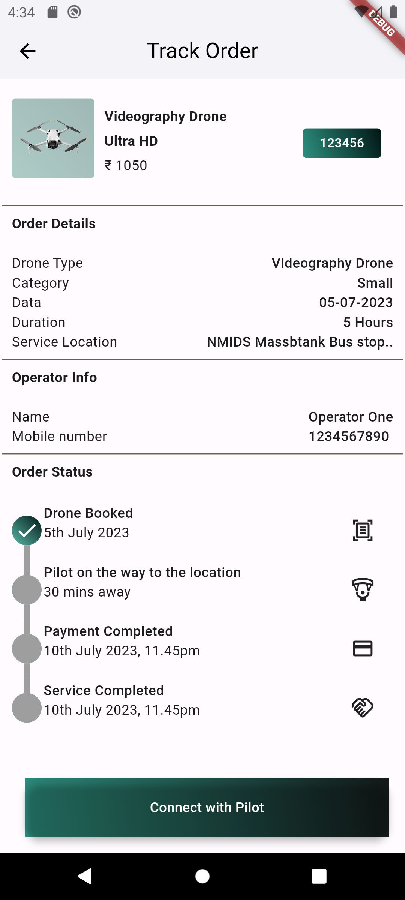
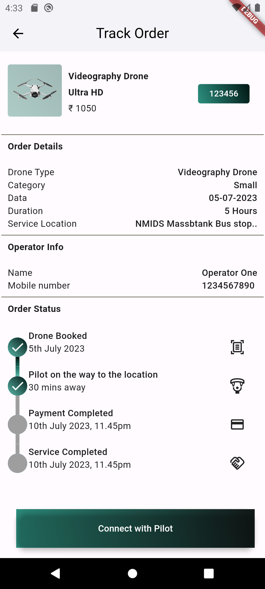
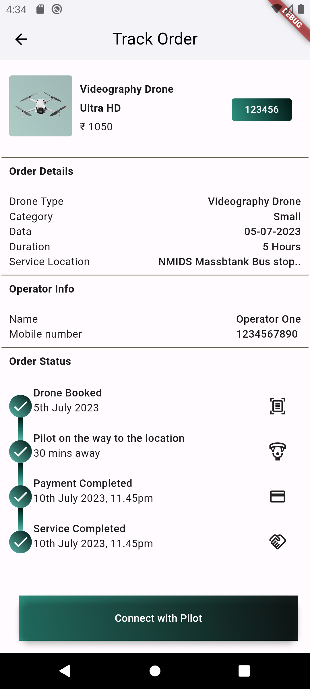
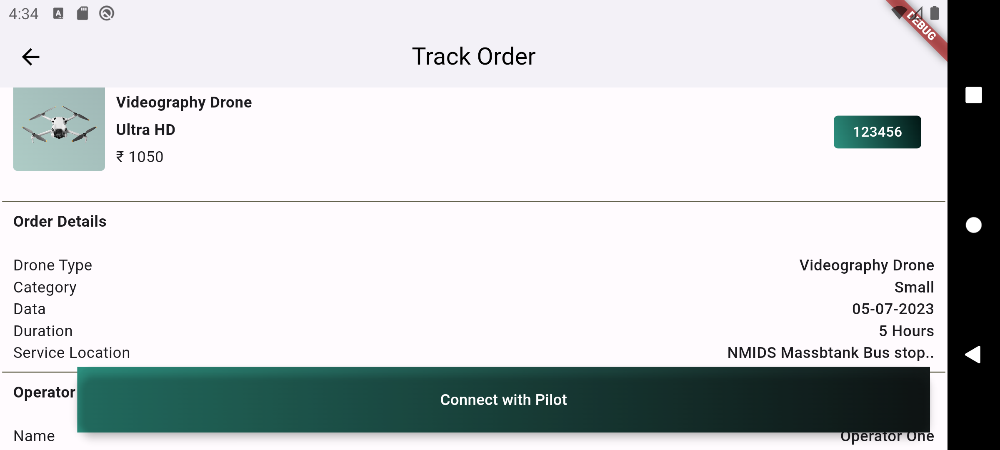
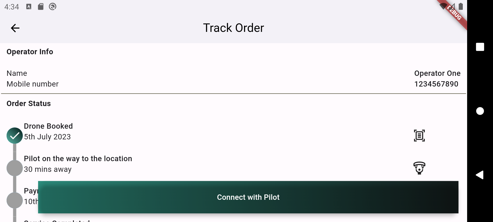
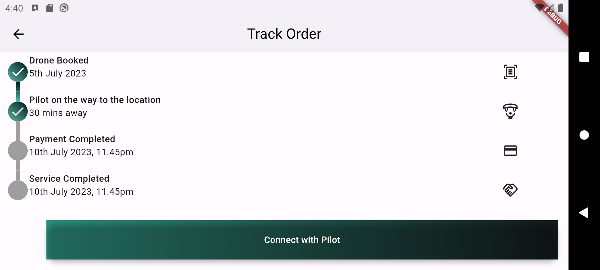

# track2

The app has UI as suggested in the mail. I haven't added API calls. The "Connect with Pilot" button changes the order tracker states as requested in the form. The UI matches the requirements. Please review the project  
  
Run: 
$flutter pub get  
$flutter run  
  
Screenshots:   
 &nbsp; &nbsp; &nbsp; &nbsp;  &nbsp; &nbsp; &nbsp; &nbsp;    
 
  
  
  

  
Yash Patil  
IIT Kanpur  
MSR-CSE 2021  
Roll-21111410  
Contact- yashpp21@iitk.ac.in  
 Mobile no.- 9168426448 / 9511713542  
  

